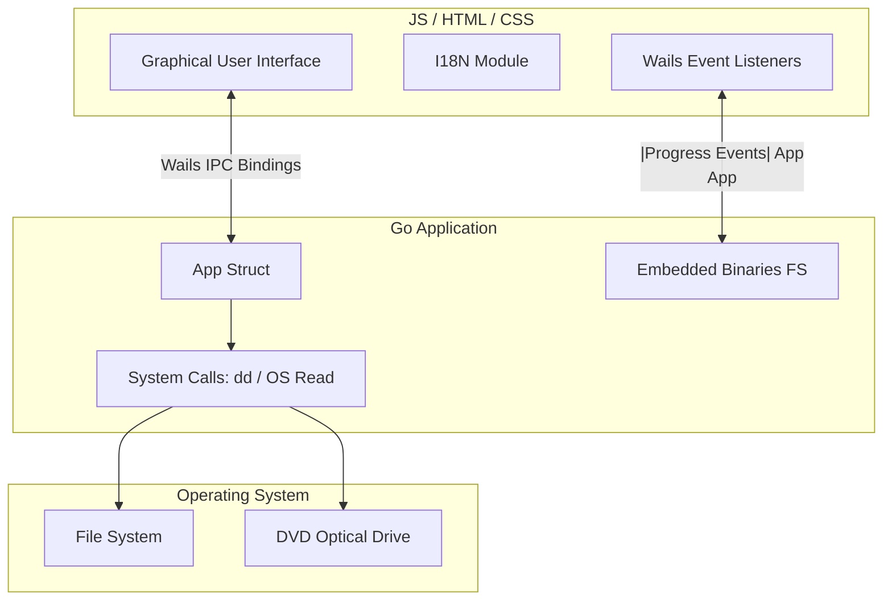

# XboxForGOD

<p align="center">
  
  
  
  
  
  
</p>

<p align="center">
  <a href="https://snapcraft.io/xboxforgod">
    
  </a>
</p>

XboxForGOD is a modern, cross-platform desktop application built with Wails that simplifies managing Xbox 360 game files. It allows users to copy game DVDs into ISO images and convert those ISOs into the GOD (Games on Demand) format, ready to be played on RGH/JTAG modified consoles.

## Features

- **DVD to ISO Extraction:** Directly create an ISO image from your Xbox 360 game DVD.
- **ISO to GOD Conversion:** Convert existing ISO files into the GOD format for seamless execution from the console's hard drive.
- **Bilingual Interface:** Fully supports English and Portuguese (PT-BR).
- **Embedded Dependencies:** The iso2god binaries are bundled directly within the application, eliminating the need for manual installations.

## Architecture

XboxForGOD follows a modern desktop application architecture leveraging the Wails v2 framework, combining Go performance with web technology flexibility.



## How it Works

1. **Insert DVD:** The application detects available optical drives using native system commands.
2. **Copy ISO:** The application extracts the disc content. On Linux, it wraps the native dd command. On Windows, it reads directly from the device block.
3. **Convert to GOD:** The application extracts the embedded iso2god utility to a temporary location and executes it against the selected ISO, piping the progress output back to the frontend in real-time.

---

### Support the Project

If you find this tool useful and would like to support its development, you can make a donation via PayPal:

[**Donate via PayPal**](https://www.paypal.com/ncp/payment/8V6WQCGN6HDCQ)

---

### Developed by
**Erasmo Cardoso**
*Software Engineer | Electronics Technician*

---

### Compatible Systems

<p>
  
  
</p>

- **Linux (amd64):** Fully compatible. Requires dd (coreutils).
- **Windows (amd64):** Fully compatible. Does not require external installations.

### Installation and Downloads

#### Linux (via Snap Store)
The easiest way to install on Linux is directly through the Snap Store. The application is isolated, self-updating, and contains all required dependencies:

[](https://snapcraft.io/xboxforgod)

*(Or via terminal: sudo snap install xboxforgod)*

#### Windows (Installer and Standalone)
Windows installation files are automatically generated during the build process and are available in the following directory:

```text
build/bin/
```
The directory contains the Windows Installer (e.g., xboxforgod-amd64-installer.exe) and the standalone binary.
