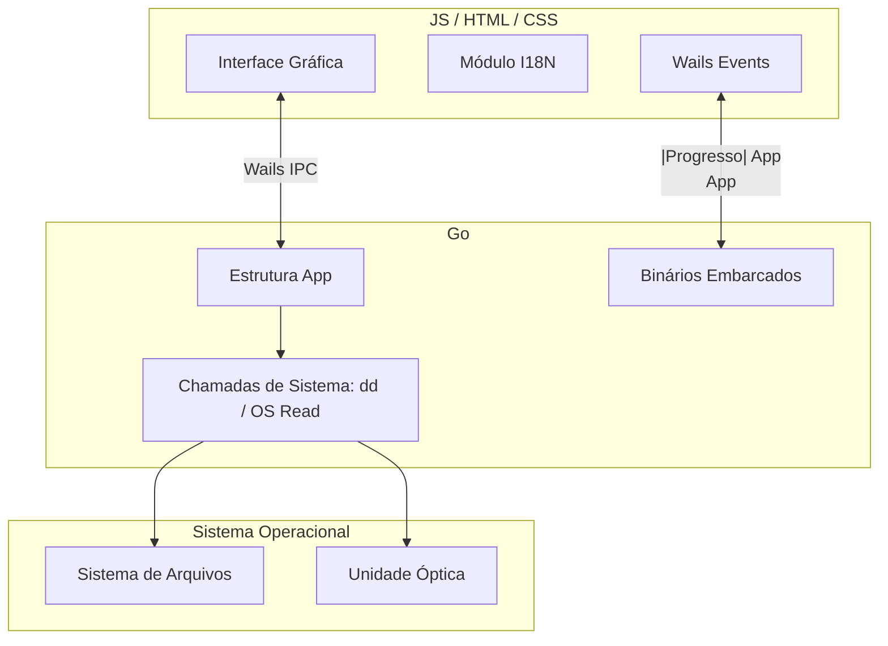

# XboxForGOD

<p align="center">
  
  
  
  
  
  
</p>

<p align="center">
  <a href="https://snapcraft.io/xboxforgod">
    
  </a>
</p>

O XboxForGOD é uma ferramenta desktop multiplataforma desenvolvida para simplificar o gerenciamento de arquivos de jogos do Xbox 360. A aplicação permite realizar a cópia de DVDs de jogos para imagens ISO e a conversão dessas imagens para o formato GOD (Games on Demand), prontas para uso em consoles com modificação RGH/JTAG.

## Funcionalidades

- **Extração de DVD para ISO:** Criação direta de imagem ISO a partir do disco original.
- **Conversão ISO para GOD:** Processamento de arquivos ISO existentes para o formato Games on Demand.
- **Interface Multi-idioma:** Suporte completo para Português (PT-BR) e Inglês.
- **Dependências Embutidas:** Os binários do `iso2god` estão integrados ao executável, dispensando instalações manuais.

## Arquitetura

O projeto utiliza o framework **Wails v2**, unindo o desempenho do Go no backend com a flexibilidade de tecnologias web no frontend.



## Funcionamento

1. **Detecção:** O backend em Go identifica as unidades ópticas disponíveis através de comandos nativos do sistema.
2. **Cópia:** A extração é realizada via `dd` (Linux) ou leitura direta do bloco de dispositivo (Windows).
3. **Conversão:** O utilitário `iso2god` é extraído para um local temporário e executado, com o progresso sendo enviado em tempo real para a interface.

---

### Apoio ao Projeto

Se esta ferramenta for útil para você e desejar apoiar o desenvolvimento contínuo, considere realizar uma doação via PayPal:

[**Doar via PayPal**](https://www.paypal.com/ncp/payment/8V6WQCGN6HDCQ)

---

### Desenvolvido por
**Erasmo Cardoso**
*Software Engineer | Electronics Technician*

---

### Sistemas Compatíveis

<p>
  
  
</p>

- **Linux (amd64):** Requer `dd` (disponível na maioria das distribuições).
- **Windows (amd64):** Totalmente independente, sem requisitos externos.

### Instalação e Downloads

#### Linux (via Snap Store)
A forma recomendada de instalação no Linux é através da Snap Store. O pacote é isolado e gerencia todas as atualizações automaticamente:

[](https://snapcraft.io/xboxforgod)

*(Ou via terminal: `sudo snap install xboxforgod`)*

#### Windows (Instalador e Executável)
Os arquivos para Windows são gerados na pasta de build após a compilação:

```text
build/bin/
```

Neste diretório estão disponíveis o **Instalador** (`xboxforgod-amd64-installer.exe`) e o executável standalone.
