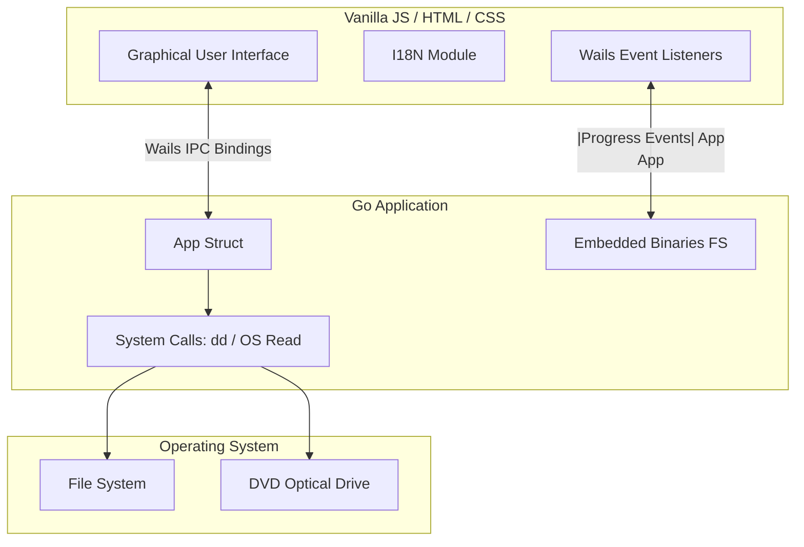

# XboxForGOD

<p align="center">
  
  
  
  
  
  
</p>

<p align="center">
  <a href="https://snapcraft.io/xboxforgod">
    
  </a>
</p>

XboxForGOD is a modern, cross-platform desktop application built with Wails that simplifies managing Xbox 360 game files. It allows users to effortlessly copy game DVDs into ISO images and convert those ISOs into the GOD (Games on Demand) format, ready to be played on RGH/JTAG modified consoles.

## ✨ Features

- **DVD to ISO Extraction:** Directly create an ISO image from your Xbox 360 game DVD.
- **ISO to GOD Conversion:** Convert existing ISO files into the GOD format for seamless execution from the console's hard drive.
- **Bilingual Interface:** Fully supports English and Portuguese (PT-BR).
- **Embedded Dependencies:** The `iso2god` binaries are bundled directly within the application, eliminating the need for manual installations.

## 🏗 Architecture

XboxForGOD follows a modern desktop application architecture leveraging the **Wails v2** framework, combining the performance of Go with the flexibility of web technologies.



### Components
1. **Frontend:** A lightweight Vanilla JavaScript interface (`index.html`, `main.js`, `style.css`) providing a responsive and dynamic user experience without the overhead of heavy web frameworks.
2. **Backend:** A Go service that interacts natively with the OS. It lists optical drives, monitors extraction progress, and manages external processes.
3. **Dependency Manager:** The `iso2god` executables (for both Linux and Windows) are securely embedded in the Go binary using `//go:embed`. During runtime, they are extracted to a temporary folder and executed automatically. 

## 🚀 How it Works

1. **Insert DVD:** The user inserts the Xbox 360 game disc. The Go backend detects available optical drives using `lsblk` (Linux) or `wmic` (Windows).
2. **Copy ISO:** The application extracts the disc content. On Linux, it wraps the native `dd` command. On Windows, it reads directly from the device block `\\.\<DriveLetter>:`.
3. **Convert to GOD:** The application extracts the embedded `iso2god` utility to a temporary location and executes it against the selected ISO, piping the progress output back to the Wails frontend in real-time.

---

### ☕ Support the Project

If you find this tool useful and would like to support its development, you can make a donation via PayPal:

[**Donate via PayPal**](https://www.paypal.com/ncp/payment/8V6WQCGN6HDCQ)

---

### Developed by
**Erasmo Cardoso**
*Software Engineer | Electronics Technician*

---

### 💻 Compatible Systems

<p>
  
  
</p>

- **Linux (amd64):** Fully compatible. Requires `dd` (coreutils) which is natively present in almost all distributions.
- **Windows (amd64):** Fully compatible. Does not require external installations.

### 📂 Instalação e Downloads

#### Ubuntu / Linux (via Snap Store)
A forma mais fácil e recomendada de instalar no Linux é diretamente pela Snap Store. O aplicativo é isolado, auto-atualizável e já contém todas as dependências de sistema:

[](https://snapcraft.io/xboxforgod)

*(Ou via terminal executando: `sudo snap install xboxforgod`)*

#### Windows (Instalador Nativo e Standalone)
Para usuários de Windows, os arquivos para instalação são gerados automaticamente durante o processo de build do Wails (Cross-Compiling via NSIS) e ficam disponíveis localmente no seguinte diretório:

```text
build/bin/
```

Dentro desta pasta você encontrará o **Instalador para Windows** (ex: `xboxforgod-amd64-installer.exe`), que instalará a aplicação e criará atalhos no Menu Iniciar/Desktop, além do binário standalone pronto para uso. O pacote já contém a interface, a lógica em Go e as dependências embarcadas num único arquivo.
